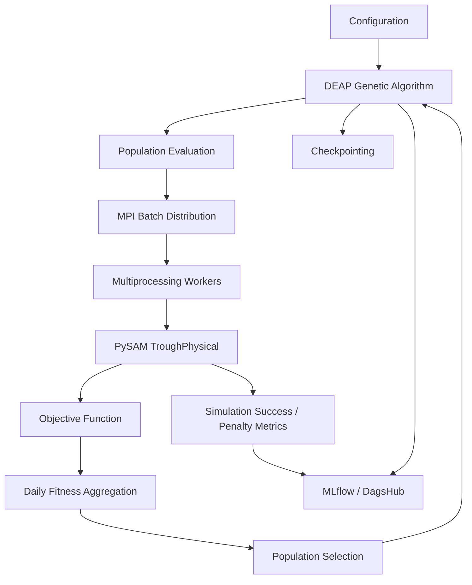

# NYS Design Optimisation using PySAM

A parallel simulation–optimisation framework for the **design and operation of a Concentrated Solar Power (CSP) parabolic-trough plant**, built using Python, NREL's System Advisor Model (SAM) through PySAM, and genetic algorithms.

The project combines physics-based solar-thermal plant simulation with evolutionary optimisation to identify promising plant design parameters and operating strategies. It supports seasonal optimisation, distributed evaluation using MPI, multiprocessing for simulation workloads, experiment tracking with MLflow and DagsHub, and checkpoint-based recovery of long-running optimisation jobs.

**Repository:** [Ary0Darkk/NYS-Design-Optimisation-using-PySAM](https://github.com/Ary0Darkk/NYS-Design-Optimisation-using-PySAM)

---

## Table of Contents

- [Overview](#overview)
- [Key Features](#key-features)
- [System Architecture](#system-architecture)
- [Optimisation Methodology](#optimisation-methodology)
- [Design and Operating Variables](#design-and-operating-variables)
- [Seasonal Optimisation](#seasonal-optimisation)
- [Parallel Execution](#parallel-execution)
- [Installation](#installation)
- [Configuration](#configuration)
- [Running the Optimisation](#running-the-optimisation)
- [HPC Execution with PBS](#hpc-execution-with-pbs)
- [Experiment Tracking](#experiment-tracking)
- [Checkpointing and Resumption](#checkpointing-and-resumption)
- [Simulation Failure Handling](#simulation-failure-handling)
- [Results and Reproducibility](#results-and-reproducibility)
- [Troubleshooting](#troubleshooting)

---

## Overview

Designing and operating a CSP plant involves multiple interacting parameters. A design that performs well under one set of conditions may not perform equally well under another season's weather and operating conditions.

This project formulates plant optimisation as a simulation-driven search problem:

1. Generate candidate plant designs and operating strategies.
2. Apply candidate parameters to a PySAM `TroughPhysical` model.
3. Execute the physics-based simulation for representative days.
4. Evaluate each simulation using a custom objective function.
5. Aggregate daily objective values into an individual fitness score.
6. Evolve the population using a genetic algorithm.
7. Track optimisation progress, simulation reliability, and the best-performing candidates.

The computationally expensive simulation evaluations are parallelised to make larger populations and repeated generations practical on a high-performance computing cluster.

## Key Features

- **Physics-based modelling:** Uses PySAM and the SAM `TroughPhysical` model.
- **Evolutionary optimisation:** Uses DEAP to implement a genetic algorithm.
- **Mixed-variable optimisation:** Supports continuous and integer-valued decision variables.
- **Season-aware evaluation:** Evaluates candidate solutions using representative days for winter, summer, monsoon, and post-monsoon conditions.
- **Distributed computation:** Uses MPI to distribute batches of candidate solutions across processes.
- **Local parallelism:** Uses Python multiprocessing to evaluate independent simulations concurrently.
- **HPC integration:** Designed for PBS Pro job scheduling on a multi-node cluster.
- **Experiment tracking:** Records GA configuration, fitness metrics, simulation success and penalty counts, and checkpoints through MLflow and DagsHub.
- **Checkpoint-based recovery:** Saves optimisation state and random-number generator states to support resuming long-running runs.
- **Failure accounting:** Distinguishes successful simulation evaluations from evaluations assigned penalty values.

## System Architecture

The optimisation pipeline has five main components.



### Main components

| Component | Responsibility |
|---|---|
| `main.py` | Entry point; parses command-line arguments, initialises MPI, and coordinates execution |
| `config.py` | Central configuration for decision-variable bounds, seasons, GA parameters, and simulation settings |
| `simulation/` | PySAM model initialisation, parameter overrides, execution, and output extraction |
| `optimisation/` | Genetic algorithm, fitness evaluation, batch distribution, and worker coordination |
| `utilities/` | Logging, helper functions, and supporting utilities |
| `results/` | Optimisation outputs and result files |
| `checkpoints/` | Saved GA states used for resuming runs |
| `job.pbs` / seasonal PBS scripts | HPC job submission and resource configuration |

*The directory descriptions above are logical responsibilities; actual filenames may vary with the current repository structure.*

---

## Optimisation Methodology

### 1. Candidate representation

Each GA individual encodes:

- Plant design variables.
- Operating variables associated with the representative days being optimised.

The current evaluation code separates the first five genes as design parameters:

```python
design_params = individual[:5]
```

The remaining genes represent daily operating decisions, with three operating parameters selected for each representative day:

```python
daily_operational = individual[
    5 + local_day_index * 3:
    5 + local_day_index * 3 + 3
]
```

This representation allows a candidate to combine a plant design with a season-specific operating strategy.

### 2. Simulation-based fitness evaluation

For each individual, the evaluation pipeline:

1. Extracts the design parameters.
2. Selects the operating parameters for the current representative day.
3. Constructs the parameter overrides.
4. Executes the PySAM model.
5. Extracts hourly outputs.
6. Computes the daily objective value.
7. Aggregates the daily values into the individual's fitness.

For a season with seven representative days, each individual requires seven daily simulation evaluations.

For a population of \(N\) individuals, one complete population evaluation therefore requires:

\[
N_{\mathrm{simulations}} = 7N
\]

assuming all seven representative-day evaluations are attempted for every individual.

### 3. Objective function

The custom objective evaluates hourly plant performance using electricity value and relevant parasitic consumption and thermal-loss terms.

Conceptually, the daily objective has the form:

\[
J_d = \sum_{h \in d} p_h
\left[
E_h-P_{\mathrm{pump},h}-P_{\mathrm{tracking},h}
-0.4\left(
P_{\mathrm{startup},h}
+P_{\mathrm{piping},h}
+P_{\mathrm{receiver},h}
\right)
\right]
\]

where:

- \(p_h\) represents the dynamic electricity-price factor used by the implementation.
- \(E_h\) represents the hourly cycle-energy output.
- \(P_{\mathrm{pump},h}\) and \(P_{\mathrm{tracking},h}\) represent parasitic consumption.
- The startup and thermal-loss terms are weighted by the configured factor of `0.4`.

This equation is a conceptual representation of the implemented calculation; the actual output definitions, unit conversions, and variable names should be checked against the current objective-function implementation.

The fitness of an individual is obtained by aggregating the objective values across the representative days assigned to that season:

\[
F(\mathbf{x}) = \sum_{d \in D_s} J_d(\mathbf{x})
\]

where \(D_s\) is the set of representative days for season \(s\).

**Optimisation direction:** The GA should use the direction configured for the objective. The objective values and penalty values must be consistent with that direction.

### 4. Genetic algorithm

The project uses DEAP for evolutionary optimisation. The configuration includes:

- Population size.
- Number of generations.
- Selection and variation operators.
- Crossover and mutation probabilities.
- Decision-variable bounds.
- Random seed and checkpoint-resumption settings.
- Hall of Fame size.

The GA evaluates candidate solutions, applies variation operators, selects the next population, updates the Hall of Fame, and records generation-level statistics.

---

## Design and Operating Variables

The following are the documented bounds from the current project configuration. Confirm the units and parameter mappings in `config.py` and the PySAM model before interpreting or changing them.

### Design variables

| Variable | Lower bound | Upper bound |
|---|---:|---:|
| `specified_total_aperture` | 8,000 | 12,000 |
| `Row_Distance` | 5 | 25 |
| `ColperSCA` | 2 | 10 |
| `W_aperture` | 1 | 15 |
| `L_SCA` | 50 | 200 |

### Operating variables

| Variable | Lower bound | Upper bound |
|---|---:|---:|
| `m_dot` | 2 | 12 |
| `T_startup` | 275 | 375 |
| `T_shutdown` | 275 | 350 |

These bounds are optimisation constraints, not universal engineering recommendations. Their physical interpretation depends on the units and model variables used in the configuration.

---

## Seasonal Optimisation

The project supports four independent seasonal runs:

- `winter`
- `summer`
- `monsoon`
- `post`

Each season has seven representative month–day pairs configured in `CONFIG["SEASONS"]`.

The seasonal workflow reduces the number of simulations compared with evaluating every day of a full year. It also allows each season to be submitted as an independent HPC job.

### Date indexing

The current implementation uses 2020 as the reference year:

```python
REFERENCE_YEAR = 2020
```

The zero-based day-of-year index is calculated from each representative date. For hourly arrays covering the entire reference year, the corresponding 24-hour slice is:

```python
start = day_index * 24
end = start + 24

daily_values = hourly_values[start:end]
```

Because 2020 is a leap year, full-year hourly arrays contain 8,784 values. The simulation outputs and electricity-price data must use compatible calendars and indexing conventions for this calculation to be correct.

---

## Parallel Execution

The project uses a two-level parallelisation strategy.

### MPI across processes or nodes

MPI distributes batches of candidate individuals across MPI ranks.

- **Rank 0:** Coordinates the GA, distributes work, collects evaluation results, performs selection, and handles central experiment tracking.
- **Worker ranks:** Receive batches, evaluate them, and return fitness results to Rank 0.

### Multiprocessing within each rank

Each rank uses a local multiprocessing pool to evaluate independent PySAM simulations concurrently.

The `LOCAL_WORKERS` environment variable controls the pool size:

```bash
export LOCAL_WORKERS=4
```

For example, with four MPI ranks and four local workers per rank, the configuration can provide up to 16 local worker processes, subject to the rank-0 implementation and available resources.

For HPC execution, the intended configuration is one MPI rank per node and a local pool sized to the allocated CPU resources. The exact pool size must match the resources allocated by PBS.

### Thread oversubscription

To avoid each worker spawning additional numerical-library threads, use the following environment settings when appropriate:

```bash
export OMP_NUM_THREADS=1
export MKL_NUM_THREADS=1
export OPENBLAS_NUM_THREADS=1
export NUMEXPR_NUM_THREADS=1
```

---

## Installation

### Prerequisites

- Linux environment or a compatible HPC compute environment.
- Python 3.12, matching the documented development environment.
- `uv` for Python environment and dependency management.
- A compatible PySAM installation and SAM model configuration.
- MPI implementation and `mpi4py` for distributed runs.
- DagsHub credentials if remote experiment tracking is enabled.

The MPI implementation and launcher must be compatible with the MPI libraries against which `mpi4py` is installed.

### Clone the repository

```bash
git clone https://github.com/Ary0Darkk/NYS-Design-Optimisation-using-PySAM.git
cd NYS-Design-Optimisation-using-PySAM
```

### Set up the Python environment

If the repository contains a `pyproject.toml` and `uv.lock`, install the project using:

```bash
uv sync
```

Activate the virtual environment if needed:

```bash
source .venv/bin/activate
```

If the repository does not yet contain a lockfile, resolve dependencies using the project's `pyproject.toml` and review the resulting environment before running expensive simulations.

### Verify the environment

Check the Python version:

```bash
python --version
```

Check the relevant packages:

```bash
uv run python -c "import deap, mlflow, mpi4py, PySAM; print('Imports successful')"
```

This command assumes that these packages are installed and importable in the active project environment.

For a local MPI installation, verify the launcher separately:

```bash
which mpirun
mpirun --version
```

A successful Python import does not, by itself, guarantee that the MPI launcher and runtime are correctly configured.

---

## Configuration

The primary configuration is maintained in `config.py`.

Before launching an optimisation, review:

1. **Simulation settings:** PySAM model name and input JSON path.
2. **Decision-variable bounds:** Lower and upper bounds for each design and operating variable.
3. **Season definitions:** Representative month–day pairs for each season.
4. **GA settings:** Population size, generation count, selection, crossover, mutation, and seed.
5. **Fitness settings:** Objective calculation and penalty value.
6. **Checkpoint settings:** Checkpoint location and whether resumption is enabled.
7. **Experiment tracking:** MLflow experiment name and DagsHub tracking configuration.

Keep the model input files, decision-variable definitions, and objective implementation consistent across runs. Changes to these can invalidate comparisons between experiments.

---

## Running the Optimisation

The entry point is `main.py`, which accepts a season argument.

### Run one season

```bash
uv run python main.py --season winter
```

Other seasons can be run independently:

```bash
uv run python main.py --season summer
uv run python main.py --season monsoon
uv run python main.py --season post
```

### Run locally with MPI

For a local setup with four MPI ranks and four multiprocessing workers configured per rank:

```bash
LOCAL_WORKERS=4 mpirun -np 4 uv run python main.py --season winter
```

Start with a small allocation and a reduced population to verify the complete evaluation pipeline before running a full GA.

**Note:** The exact command depends on the installed MPI implementation. The MPI launcher must be available in the environment and compatible with `mpi4py`.

---

## HPC Execution with PBS

The project is designed for seasonal PBS jobs on the Praganak HPC cluster. Each seasonal job can run independently, making it possible to schedule different seasons separately.

A PBS resource-request template for the intended seven-node layout is:

```bash
#!/bin/bash
#PBS -N CSP_Winter
#PBS -q large
#PBS -l select=7:ncpus=112:mpiprocs=1
#PBS -l place=scatter
#PBS -l walltime=12:00:00

set -euo pipefail

cd "$PBS_O_WORKDIR"

# Configure the Python environment and paths as required by the cluster.
export LOCAL_WORKERS=112

export OMP_NUM_THREADS=1
export MKL_NUM_THREADS=1
export OPENBLAS_NUM_THREADS=1
export NUMEXPR_NUM_THREADS=1

# Launch command is site-specific.
# Replace this with the MPI launcher and environment supported by your system.
mpirun -np 7 uv run python main.py --season winter
```

Save the script as, for example, `winter.pbs`.

Submit the job:

```bash
qsub winter.pbs
```

Create separate scripts or pass the season argument appropriately for the other seasonal runs.

### Important HPC notes

- The resource request is a template; check the current queue limits and available resources before submitting.
- The requested CPU allocation and `LOCAL_WORKERS` value must agree with the actual allocation.
- Confirm that the MPI launcher, `mpi4py`, Python environment, and PySAM installation are available on the compute nodes.
- The launcher in the example is **not confirmed for Praganak**. Determine the supported MPI module or launcher from the cluster documentation or HPC administrator before using it for a production run.
- Avoid running a large simulation workload directly on a login node.

Useful PBS commands:

```bash
# List your jobs
qstat -u "$USER"

# Inspect a particular job
qstat -f JOB_ID

# Inspect a completed job, if retained by the scheduler
qstat -xf JOB_ID

# Inspect queue configuration
qstat -Qf large
```

Replace `JOB_ID` with the actual PBS job identifier.

---

## Experiment Tracking

The project uses MLflow for experiment and metric tracking, with DagsHub as the intended remote tracking service.

The configured experiment is:

```text
CSP_Seasonal_GA
```

The repository's configured remote tracking URI is:

```text
https://dagshub.com/aryanvj787/NYS-Design-Optimisation-using-PySAM.mlflow
```

### Tracked information

The implementation is designed to record:

- GA configuration parameters.
- Generation-level fitness statistics.
- Best and aggregate fitness values.
- Simulation evaluation counts.
- Successful and penalized simulation counts.
- Simulation success rate.
- Cumulative simulation counts across resumed execution.
- Checkpoint artifacts.

The exact metrics depend on which logging calls are enabled in the current implementation.

### DagsHub authentication

Configure credentials through the supported DagsHub authentication mechanism. Do not commit passwords, access tokens, or other secrets to the repository.

DagsHub initialisation should be performed only by MPI Rank 0. Initialising remote tracking from every rank can cause redundant authentication or concurrent tracking operations.

Remote tracking configuration should be validated with a short run before submitting a large HPC workload.

---

## Checkpointing and Resumption

Long-running GA jobs can be interrupted by wall-time limits, scheduler events, or execution failures. Checkpoints preserve the state required to continue an optimisation.

The checkpoint state may include:

- Current population.
- Generation number.
- Logbook.
- Hall of Fame.
- Python random-number generator state.
- NumPy random-number generator state.
- Checkpoint validation key.
- Cumulative successful and penalized simulation counts.

When resumption is enabled and a compatible checkpoint exists, the program restores the saved state and continues from the next generation.

When the checkpoint is missing, invalid, or incompatible with the current configuration, the program should initialise a fresh GA rather than continue with an inconsistent state.

### Reproducibility considerations

For meaningful reproducibility, preserve:

- Git commit or source-code revision.
- Configuration and decision-variable bounds.
- PySAM/SAM model input files.
- Python and dependency versions.
- Random seeds and saved random states.
- Representative-day definitions.
- Objective-function implementation.
- Simulation outputs and checkpoint files.

A restored random state supports continuity of the evolutionary process, but reproducibility can still be affected by software versions, parallel execution order, or nondeterministic simulation behaviour.

---

## Simulation Failure Handling

PySAM simulations can fail because of invalid parameter combinations, model constraints, or runtime errors. The evaluation pipeline uses a penalty value to keep failed candidates from receiving an ordinary objective score.

The evaluation distinguishes two outcomes:

- **Successful:** The simulation and objective evaluation produce a valid finite fitness contribution.
- **Penalized:** The simulation reports failure, or the objective value is missing or non-finite and is replaced by the configured penalty.

Generation-level and cumulative counts make it possible to monitor the reliability of the simulation pipeline.

For a season with seven representative days, the expected number of simulation outcomes per full population evaluation is seven times the population size. Penalized outcomes should be included in this total.

Objective-function exceptions should be handled deliberately. Unexpected programming errors should not be silently converted into penalties without logging the underlying exception, since doing so can hide defects in the optimisation code.

---

## Results and Reproducibility

Inspect the configured output directories and MLflow run artifacts for:

- Best candidate solutions.
- Population and generation statistics.
- Checkpoints.
- Simulation logs.
- Experiment parameters and metrics.
- Season-specific results.

Exact filenames and output formats depend on the current implementation and configuration.

For comparisons across seasons or parameter studies, use consistent objective definitions, record configuration changes, and compare both fitness and simulation failure rates. A high apparent fitness is not sufficient evidence of a robust solution if it relies on a large number of penalized evaluations.

---

## Troubleshooting

### `ModuleNotFoundError`

Ensure that dependencies are installed in the environment used to launch the script:

```bash
uv sync
uv run python -c "import PySAM, deap, mlflow, mpi4py"
```

### MPI launcher not found

Check whether an MPI implementation is available:

```bash
which mpirun
which mpiexec
```

If neither command exists, consult the cluster's software documentation or administrator. Installing `mpi4py` alone does not necessarily install an MPI launcher.

### Job remains queued

Inspect the job and queue:

```bash
qstat -f JOB_ID
qstat -Qf large
```

A job requesting more CPUs or nodes than are currently available may remain queued until resources become available.

### Job exits unexpectedly

Inspect the PBS output and error paths reported by:

```bash
qstat -xf JOB_ID
```

Check the exit status, traceback, environment setup, working directory, and MPI launch configuration.

### Excessive simulation failures

Check:

- Whether the GA respects the configured parameter bounds.
- Whether overrides match the PySAM variable names and expected types.
- Whether the model's input JSON is valid.
- Whether each simulation receives a fresh model instance.
- Whether the objective receives arrays of the expected lengths and units.
- Whether exceptions are being logged with sufficient detail.

### Checkpoint fails to resume

Verify that the checkpoint writer and reader use identical keys for the saved population and other state fields. Confirm that the checkpoint configuration key matches the current configuration and that saved random states are present.

---

## Future Improvements

Potential directions for further development include:

- Stronger validation of simulation input parameters and units.
- More detailed failure categorisation and diagnostics.
- Automated validation of MPI and multiprocessing resource allocation.
- Standardised result exports and comparison across seasons.
- More systematic sensitivity analysis and convergence diagnostics.
- Automated tests for objective calculations, date indexing, and checkpoint recovery.

---

## Acknowledgements

This project uses the National Renewable Energy Laboratory's System Advisor Model (SAM), accessed through PySAM, for CSP plant simulation, and DEAP for evolutionary optimisation.

For technical details, consult the official documentation for [SAM](https://sam.nrel.gov/), [PySAM](https://nrel-pysam.readthedocs.io/), [DEAP](https://deap.readthedocs.io/), [MLflow](https://mlflow.org/docs/latest/), and [DagsHub](https://dagshub.com/).

